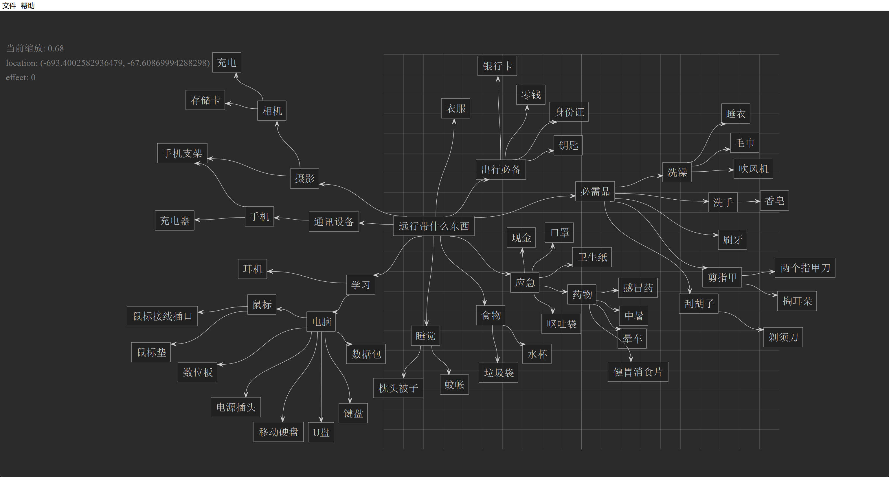
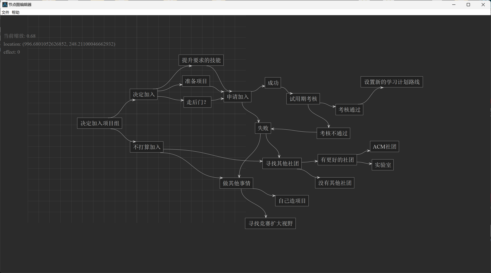
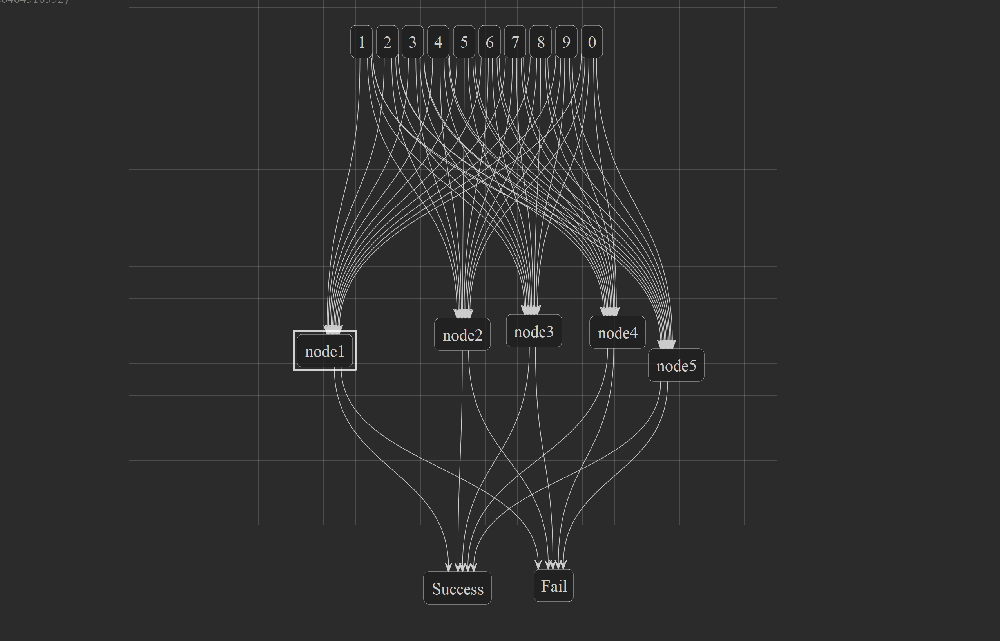
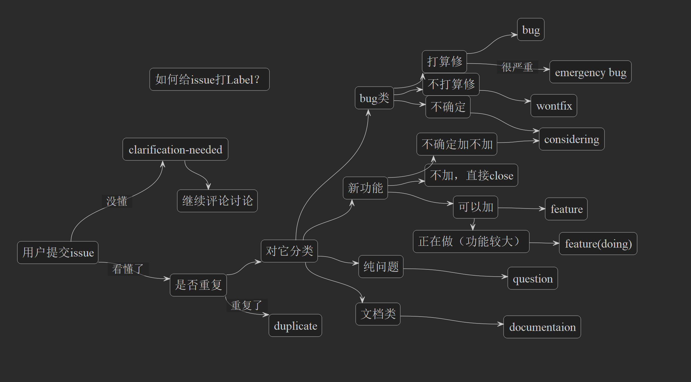
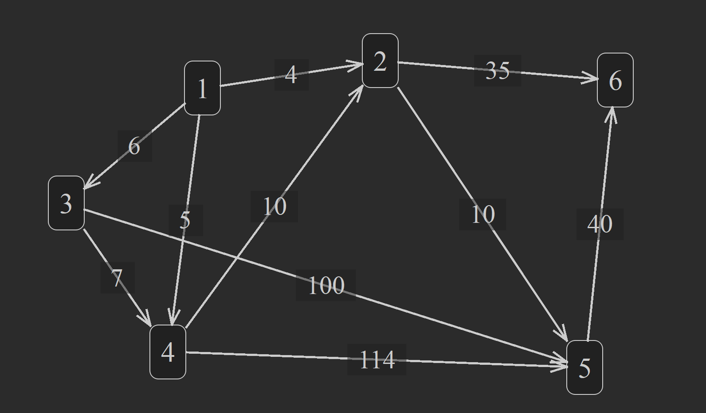

# project-graph

## ⬇️ 下载

[🐧 下载 Linux 版](https://nightly.link/LiRenTech/project-graph-qt/workflows/package/master/project-graph_linux.zip) | [🪟 下载 Windows 版](https://nightly.link/LiRenTech/project-graph-qt/workflows/package/master/project-graph_windows.zip)

### ➡️ Linux 一键安装

```sh
curl -sL https://github.com/LiRenTech/project-graph-qt/raw/master/install.sh | sudo sh
```

## ❓ 介绍与用途

这是一个快速绘制节点图的工具，可以用于项目拓扑图绘制、快速头脑风暴草稿。

Xmind 只能用来绘制树形结构图、FigJam 可以用来绘制但网页打开有点慢了



例如上面，在准备做一个事情之间可以**快速绘制**，用这个软件调动自己**有目的**的发散性思维，想到尽可能多的**可能性**

当然上面的情况本质是**树**形图，Xmind 可以完全替代



但类似于这样，想到未来的多种可能发展的时候，就不是**树**了，可能是有节点汇聚的**图**（学过数据结构肯定能理解）

此工具软件是专门为了管理项目进度，画一个拓扑图来做的。



多重连接（**批量**连线）：在视频发出后不久又新增了框选功能、并将框选的节点连向一个节点、能很**快速**的画出像神经网络一样的示意图



欢迎大家反馈问题提交issue，当阿岳在准备给新的issue打标签时，上图是他脑袋里的逻辑。



已经更新了在线段上添加文字的功能，可以用它来绘制一个**带权图**，可以用于数学题和算法题的插图。连线是**直线还是贝塞尔曲线**，可以在设置中自己调整。


## ⌨️ 操作方法

节点：

1. 创建节点：双击空白部分
2. 编辑节点名称：双击节点，出现输入框，输入确认
3. 编辑节点详情：按住Ctrl键双击节点，输入多行文本确认，鼠标悬浮在节点上的时候即可看到详情
4. 旋转节点：对准一个节点旋转滚轮，会带动整个“子树”转动
5. 移动节点：左键拖拽一个节点，但按住 Ctrl 键可以带动所有子节点拖动整个树
6. 删除节点：同样使用切割线切节点来删除

连线：

1. 增加连线：按住右键从一个节点滑动到另一个节点
2. 切断连线：在空白地方按住右键划出一道切割线
3. 选择多个连线：用框选选中一些连线，但不要框住节点，选中的连线会出现绿色
4. 连线文字编辑：选中一些连线之后按回车，输入名称，批量将这些连线上的文字更改

视野：

1. 移动视野：W A S D 键，或者鼠标中键拖拽
2. 缩放视野：鼠标滚轮，或者 `[` 和 `]`

b 站视频介绍：https://www.bilibili.com/video/BV1hmHKeDE9D

## 😋 软件特点

1. 操作快
2. 图结构

## ❗ 注意事项

可能会报病毒，但无恶意代码。若您担心可以自己使用 python 编译打包。

所有和应用相关的设置、缓存文件

Windows: `%LOCALAPPDATA%/LiRen/project-graph`

Linux: `~/.local/share/project-graph` [（可自定义）](https://specifications.freedesktop.org/basedir-spec/latest/)

## ✏️ 设计原则

好的工具应该有以下三个原则：

1. 快速创建/删除节点
2. 快速编辑节点里的文字
3. 快速连接/删除节点之间的箭头连线

该原则来自其他 up 主（所长林超）的思维导图方法论视频：https://www.bilibili.com/video/BV1sN411a79K

以上的三个原则是这个视频 10:45 秒开始的地方他提到的四个原则的总结

## 📖 开发贡献指南

本项目使用了 Qt 作为开发框架，以及 pdm 管理依赖、ruff

详见本仓库下的 docs/CONTRIBUTING.md，包含如何运行等详细内容

## ⭐ Star History

<a href="https://star-history.com/#LiRenTech/project-graph-qt&Date">
 <picture>
   <source media="(prefers-color-scheme: dark)" srcset="https://api.star-history.com/svg?repos=LiRenTech/project-graph-qt&type=Date&theme=dark" />
   <source media="(prefers-color-scheme: light)" srcset="https://api.star-history.com/svg?repos=LiRenTech/project-graph-qt&type=Date" />
   
 </picture>
</a>
