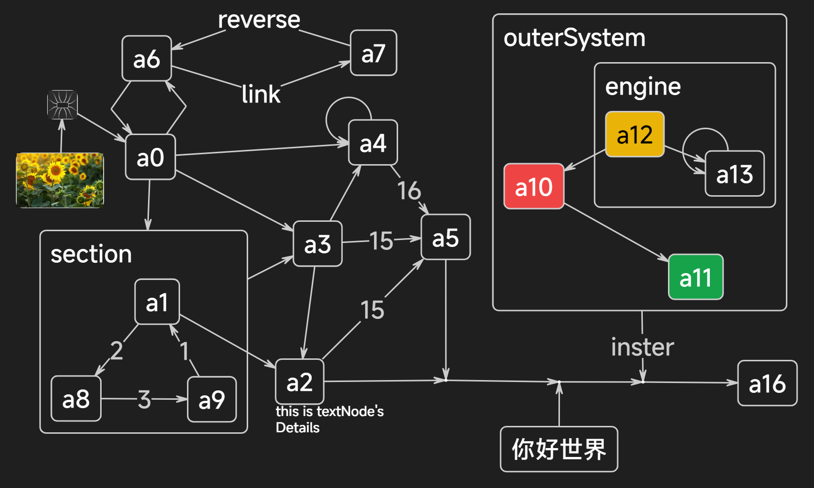

# Project Graph

## 下载地址

> [tauri版本](https://project-graph.top)
>
> （用新的框架重写了，功能还在完善中，但还未发布视频）
>
> 上述网页中有两个版本
>
> 开发版：每天早晨8点左右自动根据git上的最新情况打包构建发布
>
> 稳定版：手动发布的稳定版，不一定最新

> [PyQt5版本（两期视频中的版本）](https://github.com/LiRenTech/project-graph/releases/tag/pyqt-2024-10-3)
