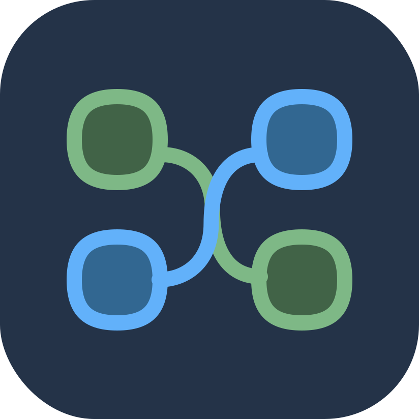

<h1>Project Graph</h1>

Next-Generation Node Diagram Tool for Visual Thinking
 

![Badge Workflow]
![Badge License]
![Badge Language]
![Badge Issues]

**[<kbd>   Install   </kbd>][Install]** 
**[<kbd>   Website   </kbd>][Website]** 
**[<kbd>   Online Demo   </kbd>][Online Demo]**

---

[NodeSupport](https://github.com/NodeSeekDev/NodeSupport) supported this project

# 🌍 Help us translate!

[![Weblate Badge]][Weblate]

Project Graph is an open-source project that aims to provide a next-generation node diagram tool for visual thinking. We need your help to translate the app into different languages.

---

**Draw fast, think efficiently** — Unleash creativity and streamline workflows with AI-powered graph design.

## 🚀 Features

- **Blazing-Fast Drawing**  
  Create complex node diagrams in seconds with drag-and-drop simplicity. Optimized with Tauri framework for seamless performance, even with thousands of nodes.

- **AI-Powered Intelligence**  
  Auto-generate tree structures and suggest node relationships using integrated large language models (e.g., ChatGPT), accelerating brainstorming and system design.

- **Dynamic Compute Engine**  
  Analyze dependencies, optimize paths, and derive logic trees in real time through a powerful graph engine.

- **Cross-Platform & Multi-Modal**  
  Native support for Windows, Linux, and experimental macOS/Android builds. Export diagrams as PNG, SVG, or JSON for diverse use cases.

- **Open Ecosystem**  
  Built with React and ~~extensible APIs~~ (WIP). MIT-licensed for unlimited customization.

---

## 📥 Installation

Refer to [Documentation](https://project-graph.top/installation)

**System Requirements**:

- Windows 10+ (Edge WebView2)
- Linux (webkit2gtk, gtk)
- _macOS support in development_

## 🎮 Quick Start

1. **Create Nodes**: Double-click canvas to add nodes.
2. **Edit Content**: Double-click nodes to rename; Ctrl+double-click for descriptions.
3. **Connect Nodes**: Right-drag between nodes to create links.
4. **Extend Node with AI**: Click "AI" button to generate child nodes with suggested relationships.

For advanced features like compute engine, see [Full Documentation](https://project-graph.top).

## 🛠 Technical Highlights

- **Architecture**: Tauri-based desktop app with Rust backend for maximum performance.
- ~~**AI Integration**: Leverage LLMs for context-aware diagram generation and knowledge graph enhancement.~~ (WIP)
- ~~**Real-Time Collaboration**: Sync edits across teams via shared project files or Git integration.~~ (WIP)

## 🌍 Community & Contribution

Join us and shape the future of visual thinking:

- **Telegram Group**: [@projectgraph](https://t.me/projectgraph)
- **QQ Group**: [1006956704](https://qm.qq.com/cgi-bin/qm/qr?k=1Wskf2Y2KJz3ARpCgzi04y_p95a78Wku&jump_from=webapi&authKey=EkjB+oWihwZIfyqVsIv2dGrNv7bhSGSIULM3+ZLU2R5AVxOUKaIRwi6TKOHlT04/)

We welcome PRs! Check [CONTRIBUTING.md](https://project-graph.top/contributing) for guidelines.

## 📜 License

MIT Licensed. Fork, modify, and distribute freely — credit appreciated but not required.

<!----------------------------------------------------------------------------->

[Install]: https://project-graph.top/installation
[Website]: https://project-graph.top
[Online Demo]: https://web.project-graph.top
[Weblate]: https://hosted.weblate.org/engage/project-graph/

<!----------------------------------{ Badges }--------------------------------->

[Weblate Badge]: https://hosted.weblate.org/widget/project-graph/open-graph.png
[Badge Workflow]: https://github.com/LiRenTech/project-graph/actions/workflows/nightly.yml/badge.svg
[Badge Issues]: https://img.shields.io/github/issues/LiRenTech/project-graph
[Badge Language]: https://img.shields.io/github/languages/top/LiRenTech/project-graph
[Badge License]: https://img.shields.io/github/license/LiRenTech/project-graph
[Badge Lines]: https://img.shields.io/tokei/lines/github/LiRenTech/project-graph
